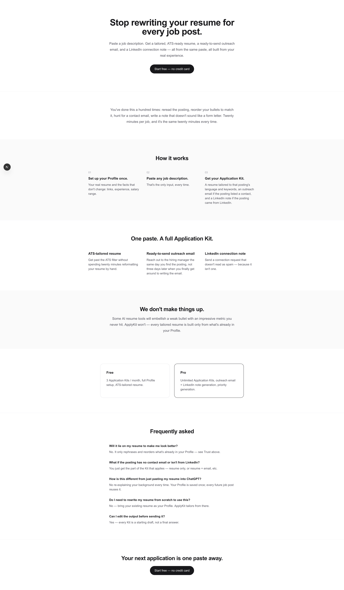
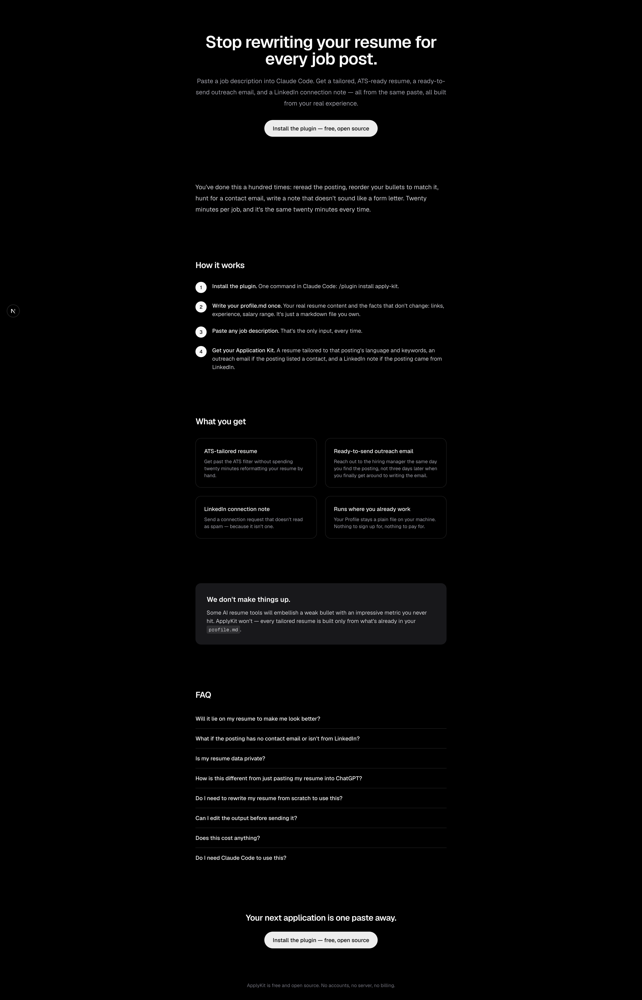
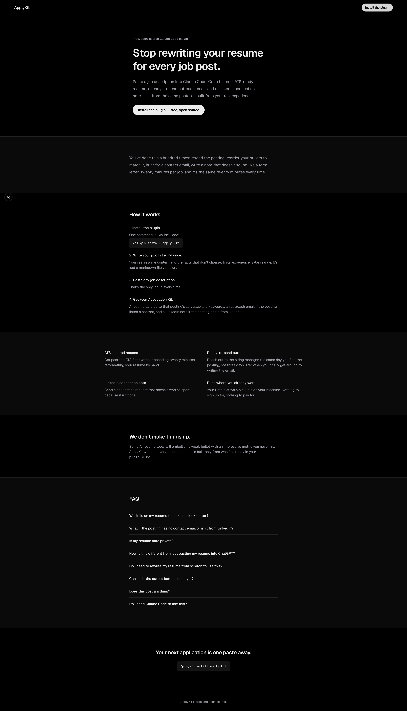
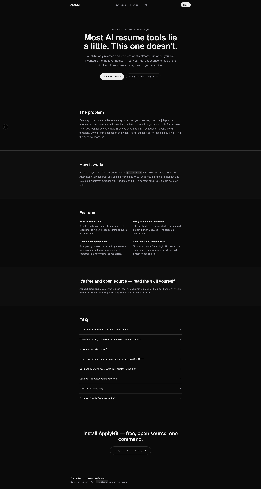
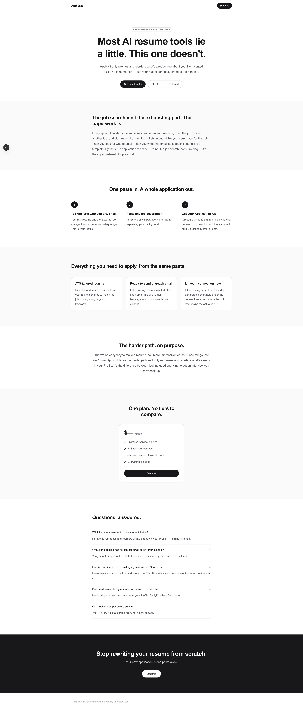
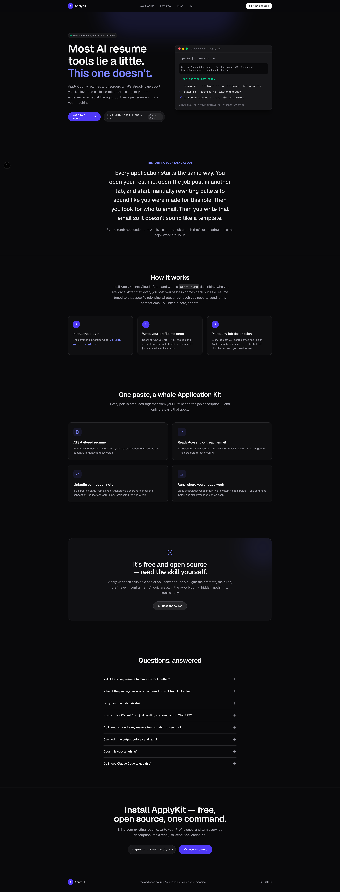
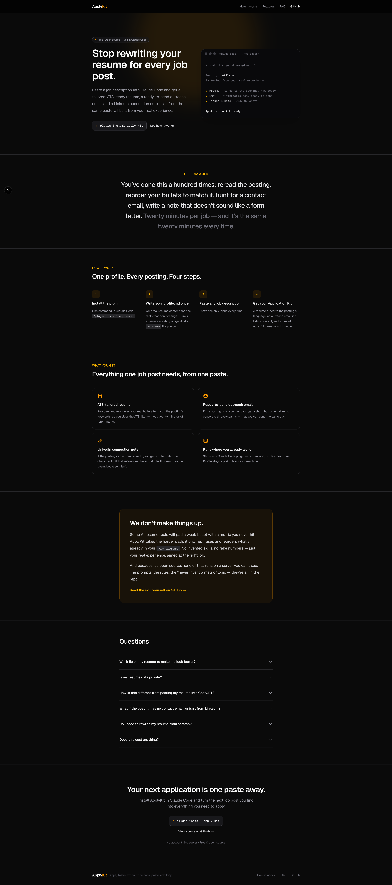

This is a [Next.js](https://nextjs.org) project bootstrapped with [`create-next-app`](https://nextjs.org/docs/app/api-reference/cli/create-next-app).

## Getting Started

First, run the development server:

```bash
npm run dev
# or
yarn dev
# or
pnpm dev
# or
bun dev
```

Open [http://localhost:3000](http://localhost:3000) with your browser to see the result.

You can start editing the page by modifying `app/page.tsx`. The page auto-updates as you edit the file.

This project uses [`next/font`](https://nextjs.org/docs/app/building-your-application/optimizing/fonts) to automatically optimize and load [Geist](https://vercel.com/font), a new font family for Vercel.

## Learn More

To learn more about Next.js, take a look at the following resources:

- [Next.js Documentation](https://nextjs.org/docs) - learn about Next.js features and API.
- [Learn Next.js](https://nextjs.org/learn) - an interactive Next.js tutorial.

You can check out [the Next.js GitHub repository](https://github.com/vercel/next.js) - your feedback and contributions are welcome!

## Deploy on Vercel

The easiest way to deploy your Next.js app is to use the [Vercel Platform](https://vercel.com/new?utm_medium=default-template&filter=next.js&utm_source=create-next-app&utm_campaign=create-next-app-readme) from the creators of Next.js.

Check out our [Next.js deployment documentation](https://nextjs.org/docs/app/building-your-application/deploying) for more details.

## Landing Page Model Comparison

Generated landing pages across different models and reasoning effort levels. Each run started from a fresh, unmodified `create-next-app` scaffold (no changes to `globals.css` or any config) — the model was simply prompted to build a landing page on top of it.

### Prompt used

> I want you to go into a separate worktree and look at the landing page folder, and I want you to generate a landing page for it. While generating the landing page, please do not use any skills or any context from conversations we've had in this system before.
>
> Rely only on the system prompt and the instructions you were given. Look at the copy, understand the product, and generate it in the separate worktree.

| Model | Effort | Preview | Notes |
|---|---|---|---|
| Sonnet | Medium |  | Light theme, no nav bar. Plain centered copy blocks, a numbered 3-step list, and a static FAQ list with no interaction. Simplest layout of the six. |
| Sonnet | High |  | Switches to a dark theme and adds numbered-circle steps, a 2x2 bordered feature grid, and a callout box for the trust section. Still no nav bar or FAQ accordion. |
| Sonnet | XHigh |  | Adds a real nav bar (logo + install button), an eyebrow label above the headline, and monospace command chips for the install step. FAQ is still a plain list. |
| Sonnet | Max |  | Fullest Sonnet build: nav with in-page links, dual hero CTAs, narrative section headings ("The problem"), and the only Sonnet tier with an expandable (+/-) FAQ accordion. |
| Opus | Medium |  | Light theme but sharper copy out of the gate — a punchier headline ("Most AI resume tools lie a little. This one doesn't."), an audience badge, a real pricing card, and a dark CTA footer band. More structure than Sonnet Medium at the same effort tier. |
| Opus | High |  | Adds a hero mockup (a fake terminal panel showing the plugin's output), indigo accent color, icon badges on each feature card, and a "Read the source" link. |
| Opus | Max |  | Same terminal hero mockup idea as Opus High, refined further: amber accent color, a 4-step "How it works" (vs. 3), icon badges on every feature card, a two-paragraph trust section with an inline GitHub link, and a full nav bar including a GitHub link. Most polished of the seven. |

Across both models, higher effort mainly buys structure (nav bar, FAQ accordion, richer step visuals) rather than new copy ideas. Opus reaches that structure at a lower effort tier than Sonnet does, and from Opus High onward it adds a distinct visual asset (the terminal hero mockup) instead of just reflowing the same sections.
